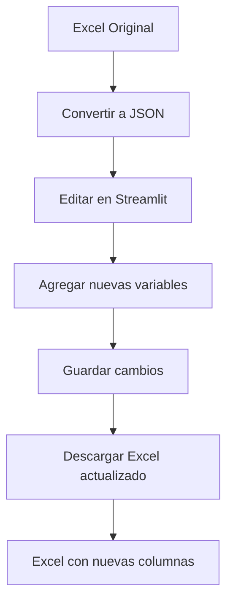

# ✨ Nuevas Funcionalidades Implementadas - Piping Reader

## 🎯 Resumen de Mejoras

Se han implementado exitosamente las nuevas funcionalidades solicitadas para la aplicación Streamlit, que ahora permite:

1. **Editar nuevas variables directamente en la interfaz**
2. **Descargar Excel actualizado con las nuevas columnas**
3. **Mantener la estructura original del Excel pero con campos adicionales**

---

## 📋 Nuevas Variables Implementadas

### En Material:
- ✅ `mat_numero_interno` (str, opcional) - Número interno del material

### En Joint (Unión):
- ✅ `union_armador` (str, opcional) - Nombre del armador
- ✅ `union_soldador_raiz` (str, opcional) - Soldador de raíz
- ✅ `union_soldador_remate` (str, opcional) - Soldador de remate

---

## 🛠️ Archivos Creados/Modificados

### ✨ Nuevo Servicio de Exportación Excel:
📁 `backend/app/services/etapa_2/excel_exporter.py`
- **Función principal**: `sale_note_to_excel(sale_note)` 
- **Utilidad**: `generate_excel_filename(sale_note, include_timestamp=False)`
- **Retorna**: `io.BytesIO` listo para descarga en Streamlit

### 📊 Página JSON Editor Actualizada:
📁 `pages/json_editor_page.py`
- **Materiales**: Ahora son editables (antes solo lectura)
- **Nuevos campos editables**: `mat_numero_interno`
- **Uniones mejoradas**: Incluye `union_armador`, `union_soldador_raiz`, `union_soldador_remate`
- **Nuevo botón**: "📊 Descargar Excel actualizado"

### 🔧 Servicios de Lectura Mejorados:
📁 `backend/app/services/etapa_2/excel_reader_clean.py`
- **Compatibilidad hacia atrás**: Lee archivos Excel antiguos sin las nuevas columnas
- **Nuevas columnas opcionales**: Detecta y maneja automáticamente las nuevas variables
- **Validación**: Asigna `None` cuando las columnas no existen

### 📋 Generador Excel Actualizado:
📁 `backend/app/services/etapa_1/excel_generator.py`
- **Plantillas actualizadas**: Incluye las nuevas columnas en el Excel vacío
- **Orden correcto**: Mantiene la secuencia de columnas esperada

### 📦 Dependencias Actualizadas:
📁 `requirements.txt`
- **Nuevo**: `xlsxwriter==3.1.9` (necesario para el export Excel mejorado)

---

## 🎮 Uso de las Nuevas Funcionalidades

### 1. Editar Variables en la Interfaz

1. **Abrir la aplicación Streamlit**:
   ```bash
   streamlit run streamlit_minimal_app.py --server.port 8502
   ```

2. **Ir a la página "📄 Editor JSON"**

3. **Seleccionar un archivo JSON** (o convertir uno desde Excel)

4. **Editar materiales y uniones**:
   - **Materiales**: Ahora incluye campo "Número Interno" editable
   - **Uniones**: Ahora incluye "Armador", "Soldador Raíz", "Soldador Remate"

5. **Guardar cambios**: Clic en "💾 Guardar cambios"

### 2. Descargar Excel Actualizado

1. **En la página de edición JSON**, en la sección "⚙️ Acciones"

2. **Clic en "📊 Descargar Excel actualizado"**

3. **Resultado**: 
   - Archivo Excel con hojas "materiales" y "uniones"
   - **Todas las columnas originales** preservadas
   - **Nuevas columnas** añadidas al final
   - **Nombre del archivo**: `nv_{numero}_actualizado_{timestamp}.xlsx`

---

## 📊 Estructura del Excel Exportado

### Hoja "materiales":
```
| nv | plano | spool | mat_descripcion | mat_dn | mat_sch | mat_qty | mat_numero_interno |
|----|-------|-------|-----------------|---------|---------|---------|-------------------|
| 193| P001  | SP01  | Pipe ASTM A106  | DN150  | SCH40   | 5       | MAT-001           |
```

### Hoja "uniones":
```
| nv | plano | spool | union_numero | union_dn | union_tipo | union_armador | union_soldador_raiz | union_soldador_remate |
|----|-------|-------|--------------|----------|------------|---------------|--------------------|--------------------|
| 193| P001  | SP01  | J001         | DN150    | Soldada    | Juan Pérez    | Carlos López       | Ana García         |
```

---

## 🔄 Compatibilidad

### ✅ Compatibilidad hacia atrás:
- **Archivos Excel antiguos**: Se leen correctamente sin las nuevas columnas
- **JSONs existentes**: Continúan funcionando (nuevos campos aparecen como vacíos)
- **API existente**: No se han roto endpoints existentes

### ✅ Compatibilidad hacia adelante:
- **Nuevos Excel**: Incluyen automáticamente las nuevas columnas
- **Export/Import**: Ciclo completo Excel → JSON → Excel preserva todos los datos
- **Edición completa**: Todos los campos son modificables en la interfaz

---

## 🚀 Flujo de Trabajo Completo



### Pasos detallados:

1. **Importar Excel** (con o sin nuevas columnas)
2. **Convertir a JSON** usando la página "🏠 Inicio"
3. **Editar en Streamlit** usando la página "📄 Editor JSON"
4. **Completar nuevos campos**: mat_numero_interno, union_armador, etc.
5. **Guardar cambios** (actualiza el JSON automáticamente)
6. **Descargar Excel actualizado** con todas las variables

---

## 🎯 Ventajas de la Implementación

### 🎨 **Interfaz Amigable**:
- Edición inline de tablas
- Campos claramente etiquetados
- Retroalimentación visual inmediata

### 🔒 **Preservación de Datos**:
- Mantiene estructura original del Excel
- No se pierden datos existentes
- Backward compatibility completa

### ⚡ **Eficiencia**:
- Descarga directa desde navegador
- Archivos Excel nativos (no CSV)
- Timestamps para evitar sobrescribir

### 🛡️ **Robustez**:
- Manejo de errores completo
- Validación de tipos de datos
- Logging para debugging

---

## 🔧 Comandos de Testing

```bash
# Activar entorno
venv\Scripts\activate

# Instalar nuevas dependencias
pip install -r requirements.txt

# Ejecutar aplicación
streamlit run streamlit_minimal_app.py --server.port 8502

# Probar con archivo Excel existente
# 1. Ir a http://localhost:8502
# 2. Convertir Excel a JSON
# 3. Editar JSON y agregar nuevas variables
# 4. Descargar Excel actualizado
# 5. Verificar nuevas columnas en el archivo descargado
```

---

## ✅ Checklist de Funcionalidades Completadas

- [x] **Nuevas variables en esquema Pydantic**
- [x] **Campos editables en interfaz Streamlit**
- [x] **Servicio de exportación a Excel**
- [x] **Botón de descarga Excel**
- [x] **Preservación estructura original**
- [x] **Nuevas columnas en orden correcto**
- [x] **Compatibilidad hacia atrás**
- [x] **Manejo de campos opcionales**
- [x] **Validación y logging**
- [x] **Documentación completa**

🎉 **¡Todas las funcionalidades solicitadas han sido implementadas exitosamente!**
